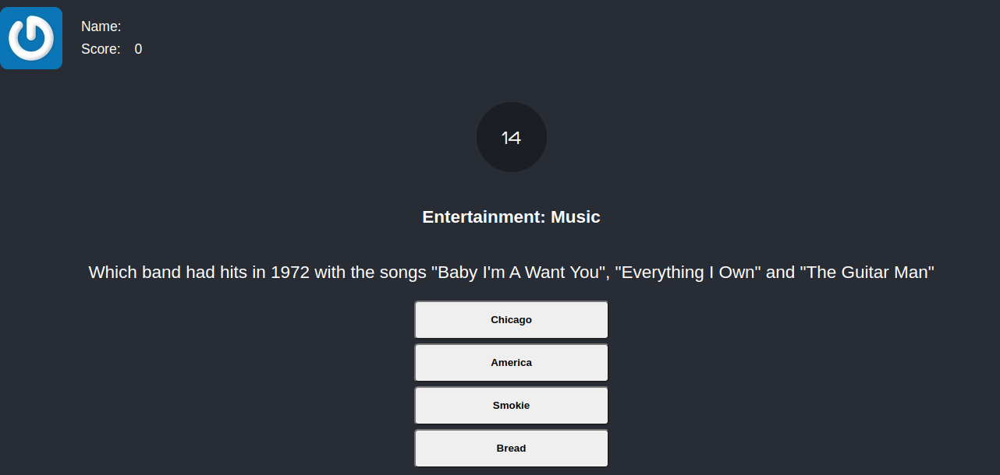
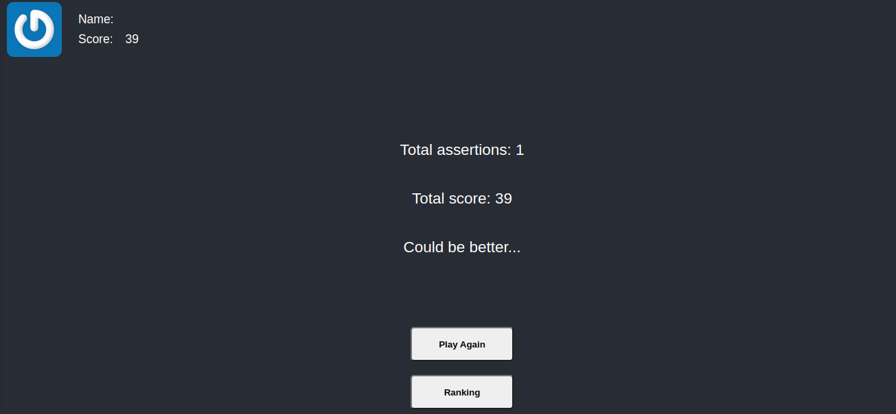

# 🎮 Jogo Trivia

## :satellite: Desenvolvimento

Projeto desenvolvido na <a href="https://betrybe.com/" target="_blank">Trybe</a> durante o módulo de Front-End!

Nesse projeto desenvolvemos uma aplicação de um jogo de perguntas e respostas, fizemos requisições para a API do Trivia.

## :hammer_and_wrench: Tecnologias

* HTML
* CSS
* JavaScript
* React.js
* Redux

## Preview ScreenShots

## Contribuições: 
Pedro Costa
Matheus Santos
Pedro Jorge
Marcelo Marques
